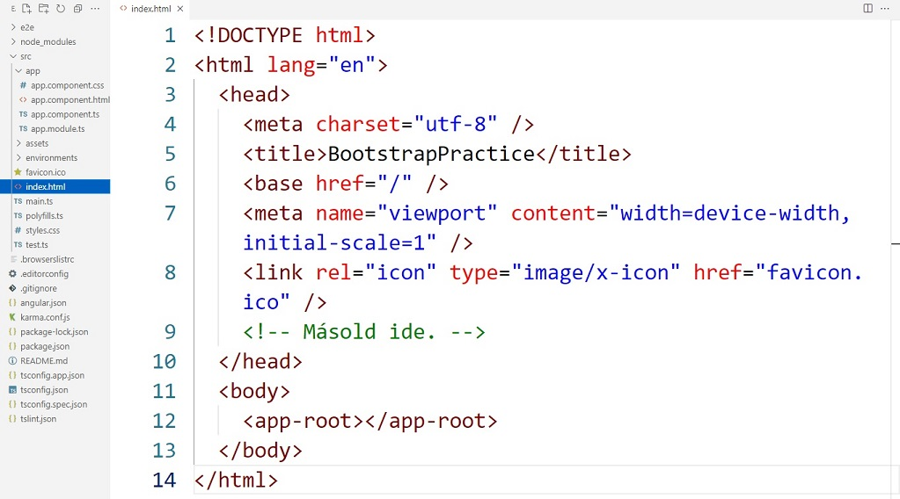
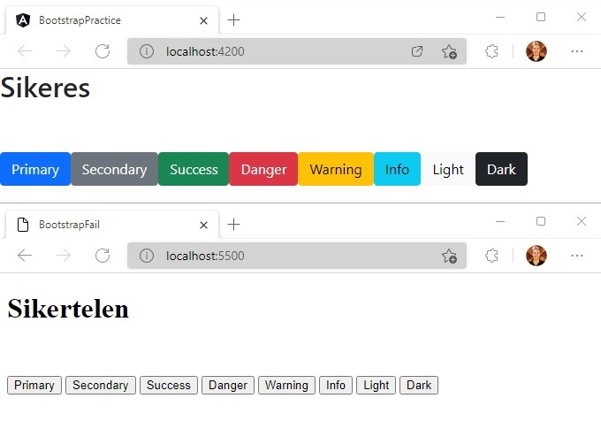

# Angular Bootstrap legkönnyebben

Az alábbi módon lehet a legkönnyebben és a leggyorsabban hozzáadni a Bootstrap-et az Angular projektünkhöz.

## Teendő

Másoljuk ki az alábbi sorokat:

```html
<link
  href="https://cdn.jsdelivr.net/npm/bootstrap@5.1.3/dist/css/bootstrap.min.css"
  rel="stylesheet"
  integrity="sha384-1BmE4kWBq78iYhFldvKuhfTAU6auU8tT94WrHftjDbrCEXSU1oBoqyl2QvZ6jIW3"
  crossorigin="anonymous"
/>
<script
  src="https://cdn.jsdelivr.net/npm/bootstrap@5.1.3/dist/js/bootstrap.bundle.min.js"
  integrity="sha384-ka7Sk0Gln4gmtz2MlQnikT1wXgYsOg+OMhuP+IlRH9sENBO0LRn5q+8nbTov4+1p"
  crossorigin="anonymous"
></script>
```

Másoljuk be az `src/index.html` alábbi sorába:



## Ellenőrzés

Töröljük az `src/app/app.component.html` minden tartalmát.

Másoljuk be oda az alábbi sorokat:

```html
<button type="button" class="btn btn-primary">Primary</button>
<button type="button" class="btn btn-secondary">Secondary</button>
<button type="button" class="btn btn-success">Success</button>
<button type="button" class="btn btn-danger">Danger</button>
<button type="button" class="btn btn-warning">Warning</button>
<button type="button" class="btn btn-info">Info</button>
<button type="button" class="btn btn-light">Light</button>
<button type="button" class="btn btn-dark">Dark</button>
```

<br>

Futtassuk a terminálban az `ng s -o` parancsot és hasonlítsuk össze a végeredményt az alábbi képpel.

<br>



Ha mindent jól csináltunk, akkor színes gombokat látunk. 👏
