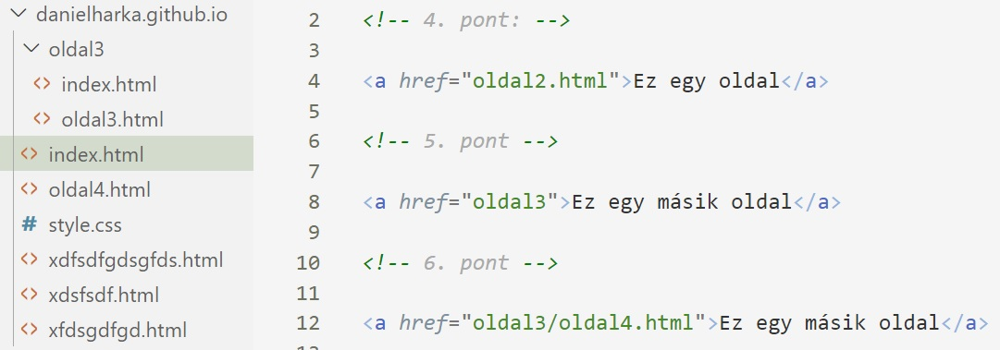

# Honlap (.html) feltöltése a netre

Érdekel, hogy hogyan tudod teljesen ingyenesen feltölteni az első honlapodat a webre, hogy ne csak egy sima html legyen a gépeden, amit kizárólag te látsz, hanem bármelyik böngészőből elérhető legyen?

Ez a leírás pontról-pontra végigvezet rajta. Ez már a GitHub szerverén elhelyezett, ténylegesen "Ez az első honlapom!" lesz, a korábbiakkal ellentétben. :D

Igyekeztem érthetően fogalmazni, de visszajelzéseket és kérdéseket szívesen fogadok <a
          href="https://facebook.com/MrDanielHarka"
          target="_blank"
          rel="noreferrer noopener nofollow"
          >Facebook</a
        >-on vagy a
<a
          href="https://discord.gg/5kh7GszCKC"
          target="_blank"
          rel="noreferrer noopener nofollow"
          >Discord</a
        >
szerverünkön. :)

## Kedvcsináló

Az alábbi honlapok mind ezzel (vagy nagyon hasonló) folyamattal lettek publikálva.

- <a
         href="https://noemikadas.github.io"
         target="_blank"
         rel="noreferrer noopener nofollow"
         >noemikadas.github.io</a
       > (<a
         href="https://github.com/NoemiKadas/NoemiKadas.github.io"
         target="_blank"
         rel="noreferrer noopener nofollow"
         >kód</a
       >)
- <a
         href="https://mokuslekvar01.github.io"
         target="_blank"
         rel="noreferrer noopener nofollow"
         >mokuslekvar01.github.io</a
       > (<a
         href="https://github.com/Mokuslekvar01/Mokuslekvar01.github.io"
         target="_blank"
         rel="noreferrer noopener nofollow"
         >kód</a
       >)
- <a
        href="https://sara.harka.com"
        target="_blank"
        >sara.harka.com</a
      > (<a
        href="https://github.com/MrDanielHarka/sara.harka.com"
        target="_blank"
        >kód</a
      >)
- <a
          href="https://daniel.harka.com"
          target="_blank"
          >daniel.harka.com</a
        > (<a
          href="https://github.com/MrDanielHarka/mrdanielharka.github.io"
          target="_blank"
          >kód</a
        >)
- <a
          href="https://okj.harka.com"
          target="_blank"
          >okj.harka.com</a
        > (<a
          href="https://github.com/MrDanielHarka/okj.harka.com"
          target="_blank"
          >kód</a
        >)

Küldd el, ha kész a tiéd is és felrakom ide. :)

## 1. Feltöltendő honlap elkészítése

1.  Hozz létre egy új mappát amibe teszed a honlap fájljait.
2.  Opcionális: Javaslom a `keresztnevedvezetekneved.github.io` mappanevet, mert ez lehet egy lehetséges név a honlapod publikálására.
3.  A mappában hozz létre egy `index.html` fájlt.
4.  Hozz létre egy `style.css` fájlt.
5.  Linkeld össze a kettőt.
6.  Készítsd el a honlapodat.

## 2. GitHub felhasználó létrehozása

Ha ez már megvan, akkor ugorj a következő alcímhez!

1.  Regisztrálj GitHub-ra. (<a
          href="https://github.com/signup"
          target="_blank"
          rel="noreferrer noopener nofollow"
          >github.com/signup</a
        >)
2.  Adj meg egy olyan email-t amit nézel is.
3.  Aztán egy jelszót, amit meg is jegyzel. :D
4.  FONTOS! Majd pedig egy felhasználónevet, ami `KeresztnevVezeteknev` módon néz ki.
5.  **Nem muszáj nagybetűnek lennie. Később viszont általában így utalok a felhasználónévre, mert így könnyen kiolvasható/értelmezhető.**
6.  "Would you like to receive product updates and announcements via email? Type "y" for yes or "n" for no." Itt nyomj egy `n`-t.

7. Katt a `Start puzzle`-re.
8. Katt a legvilágosabb 3, 4 vagy 5 ágú, spirálos képre.
9. Katt a `Create account`-ra.
10. Nézd meg a mailed és Ctr+V-zd vagy írd be a kapott számot.

## 3. Repository létrehozása és honlap feltöltése

1.  Jelentkezz be GitHub-ra. (<a
          href="https://github.com/login"
          target="_blank"
          rel="noreferrer noopener nofollow"
          >github.com/login</a
        >)
2.  Új repo (repository) létrehozása. (<a
          href="https://github.com/new"
          target="_blank"
          rel="noreferrer noopener nofollow"
          >github.com/new</a
        >)
3.  A `repository name` legyen:
    - `aMegadottFelhasznaloNeved.github.io`.
    - Azaz, ha a korábbi pont szerint helyesen regisztráltál GitHub-ra, akkor `KeresztnevVezeteknev.github.io`.
    - Ha más felhasználóneved van, akkor azt add meg a `.github.io` elé.
    - Ellenőrzésképpen ezt a felhasználónevet látod bal oldalon az `Owner` szöveg alatt.
    - Lehet benne kis és nagybetű is. `keresztnevvezeteknev` vagy `KeresznevVezeteknev`.
    - Mindkét módon meg fog jelenni a böngészőben.
4.  Írhatsz bármilyen `Description`-t, de nem muszáj.
5.  Mindenképpen maradjon `Public`.
6.  Az oldal aján levő 3 pipát nem kell kipipálni. Bármikor lehet változtatni.
7.  Klikk a `Create repository`-ra.
8.  Újratölt az oldal és rengeteg szöveg lesz rajta. Neked csak a kék négyzetben levő `uploading an existing file` linkre kell kattintanod.
9.  Fájlok feltöltésének módjai:
    - Megnyitod a mappát, ahol van az index.html, style.css meg egyéb fájlok, ami a honlapodhoz tartozik. Kijelölöd mindet és behúzod a fenti négyzetbe.
    - Rákattintasz a `choose your files` szövegre, kikeresed a mappádat és nyomsz egy Ctrl+A -t vagy Ctrl lenyomása közben rákattintgatsz azokra a fájlokra, amiket fel szeretnél tölteni és a jobb lenti sarokba kattintva feltöltöd.
10. Várd meg míg feltöltődnek a fájlok.
11. Nem muszáj semmit beíni, csak kattints a `Commit changes`-re.
12. Kicsit töltöget még, aztán frissül az oldal.
13. Most kattints a jobb fenti sarokban levő `Settings` gombra.
14. Majd pedig a bal oldalon a `Pages` gombra.
15. A `None` menüt váltsd át `main`-re, majd klikk `Save`.

## 4. Honlapod leellenőrzése/meglátogatása

Ha az előző pontokat helyesen és maradéktalanul végigcsináltad, akkor 2-10 percen belül megjelenik a már ténylegesen "Ez az első honlapom!" bármelyik böngészőben az alábbit beírva:

`aMegadottFelhasznaloNeved.github.io` Wow!

## 5. Már feltöltött honlap módosítása

1. Megnyitod azt a repo-t, ahova feltöltötted a honlapodat.
2. Rákattintasz arra a (html, css, js, stb.) fájlra, amit módosítanál.
3. A jobb fenti sarokban a ceruzára kattintva módosítani tudod és be tudod másolni az új fájl kódját vagy a kukára kattintva törölheted és feltöltheted az újat.

## 6. Ötletek egy fullos honlap elkészítéséhez

> Amiket honlapokat használok a példákban **nem** azért vannak, hogy pont olyanokat csinálj, mint amilyenek azok, hanem mert tudom, hogy azoknak minimalista és könnyen érthető a kódja. Nyugodtan csinálj azoknál jobbakat, szebbeket, funkcionálisabbakat és egyedibbeket. :)

### **1. Előkészületek**

0.  Hozz létre egy index.html-t és style.css-t. (Remélhetőleg ez már kész. Ugrás a következő pontra.)
1.  Hozz létre egy okj mappát és azon belül egy index.html-t.
2.  Hozz létre egy portfolio.html-t.
3.  Hozz létre egy info.html-t.
4.  Hozz létre egy stb.html-t.

### **2. index.html**

0.  Remélhetőleg már ez is kész. Ugrás a következő alcímre.
1.  Legyen rajta egy bemutatkozás, hasonlóan a <a
              href="https://daniel.harka.com"
              target="_blank"
              >daniel.harka.com</a
            >
    oldalhoz.
2.  Tehetsz fel egy képet is magadról.

### **3. style.css**

0.  Remélhetőleg már ez is kész. Ugrás a következő alcímre.
1.  Hozd itt létre azokat a stílusokat, amiket az összes össszes oldalon szeretnél látni.
2.  Később ahogy a többi oldalt létrehozod hozz létre új CSS deklarációkat.

### **4. okj/index.html**

1. Tedd be az okj mappába az összes webfejlesztős gyakorlásodat/házidat.

A fájl struktúra valahogyan így nézzen ki:

2. Az okj/index.html legyen egy linkgyűjtemény oldal, hasonlóan a <a
   href="https://okj.harka.com"
   target="_blank"> okj.harka.com</a> oldalhoz.

1. Linkeld be az összes megcsinált webfejlesztéses házidat.
1. A linkek nyíljanak meg új lapon/fülön/tabon, nem a jelenlegi nézetben.
   > Ez azért fontos, mert így ezeket az oldalakat nem kell visszalinkelni az okj/index.html-hez, hanem az tab/fül bezárásával, azonnal visszakerülnek a látogatók az okj.html oldalra.
1. Az oldal aljára tegyél egy szintén új lapon/fülön/tabon megnyíló linket, ami a GitHub repo-don belüli okj mappát nyitja meg, nem pedig a profilodat. A link valahogy így fog kinézni: `https://github.com/KeresztnevVezeteknev/KeresztnevVezeteknev/tree/main/okj`

### **5. portfolio.html**

1. Csinálj egy portfolió oldalt hasonlóan a
   <a href="https://daniel.harka.com/work" target="_blank">daniel.harka.com/work</a> oldalhoz.

2. Itt csak azokat a gyakorlásokat/feladatokat linkeld be, amikre a legbüszkébb vagy és szívesen megmutatnád valakinek vagy amiket használnál referenciamunkaként álláskereséskor.
3. Linkeléskor "lépj be" az okj mappába és onnan linkeld be a html fájlokat. Valahogy így: `<a href="okj/gyakorlas1" target="_blank" >Egyik projektem</a>`
4. Legfelül legyen az, amelyikre a legbüszkébb vagy, majd pedig 'csökkenő sorrendben" a többi.
5. Ha esetleg még nincsen olyan oldal, amire nagyon büszke lennél, párat akkor is válassz ki az okj-s oldaladról és linkelj azokhoz itt.

### **6. info.html**

1.  Legyen rajta egy hosszabb bemutatkozás vagy szöveg, hasonlóan a <a
        href="https://noemikadas.github.io/practise.html"
        target="_blank"
        rel="noreferrer noopener nofollow"
        >noemikadas.github.io</a>
    oldalhoz, csak ne lorem ipsumokat írj. :D
2.  Ide már mindenképpen tegyél egy képet. Magadról, párodról, kutyádról, macskádról vagy a kocsidról.
3.  Legyen itt email cím, a szociális linkjeid, meg a GitHub linkedet is megjelenítheted, ami a profilodra mutat. Ezek ugyancsak nyíljanak meg új lapon. Meg tegyél ide még, amit csak szeretnél.

### **7. stb.html**

Ezt pedig nevezd át arra, amire csak szeretnéd és rakj bele bármilyen tetszőleges tartalmat. Légy egyedi és kreatív! :)

### **8. index.html, okj/index.html, portfolio.html, info.html és az stb.html**

1.  Az oldal tetején legyenek linkek, ami a többi html-re mutat.
2.  Az oldal alján egy footer szövegként legyen ott, hogy ki csinálta a honlapot.
3.  Legyenek összekötve a style.css fájlal, hogy minden oldalon egységes legyen a dizájn és ne kelljen újra meg újra lekódolni a kinézetet.
4.  Ha egy html fájl amihez linkelni szeretnél a root/gyökérkönyvtárban van az index.html mellett akkor így tudsz hozzá linkelni:
    `<a href="oldal2.html">Ez egy oldal</a>`.
5.  Ha pedig egy másik mappában van, akkor nevezd el a megjeleníteni kívánt oldalt index.html-nek és az elérési útba a **mappa** nevét írd be és hagyd el a `.html` fájlkiterjesztést és a böngésző automatikusan tudni fogja, hogy a mappán belül az index.html-t nyissa meg.
    Példa: `<a href="oldal3">Ez egy másik oldal</a>`.
6.  Ha egy almappán belül az index.html-en kívűl más html-t szeretnél megnyitni, akkor kell a html fájl neve és a .html a végére.
    Példa: `<a href="oldal3/oldal4.html">Ez egy másik oldal</a>`

Kép a 4, 5 és 6-os ponthoz

7. Nagyon opcionális: Ha szeretnéd, hogy gyorsan töltsenek be az oldalaid, akkor egy `compress image online` vagy `online image compressor` szolgáltatás segítségével tömörítheted a képeket.

## 7. Gratuláció!

Nagyon gratulálok és elképesztően büszke vagyok rád, amennyiben ezt úgy olvasod, hogy végigcsináltad az egészet. Ha csak idegörgettél, akkor nyomás vissza az elejére! :D

Ismét megjegyzem, hogy visszajelzéseket és kérdéseket szívesen fogadok <a
          href="https://facebook.com/MrDanielHarka"
          target="_blank"
          rel="noreferrer noopener nofollow"
          >Facebook</a
        >-on vagy a
<a
          href="https://discord.gg/5kh7GszCKC"
          target="_blank"
          rel="noreferrer noopener nofollow"
          >Discord</a
        >
szerverünkön.

**Csak így tovább! :)**
